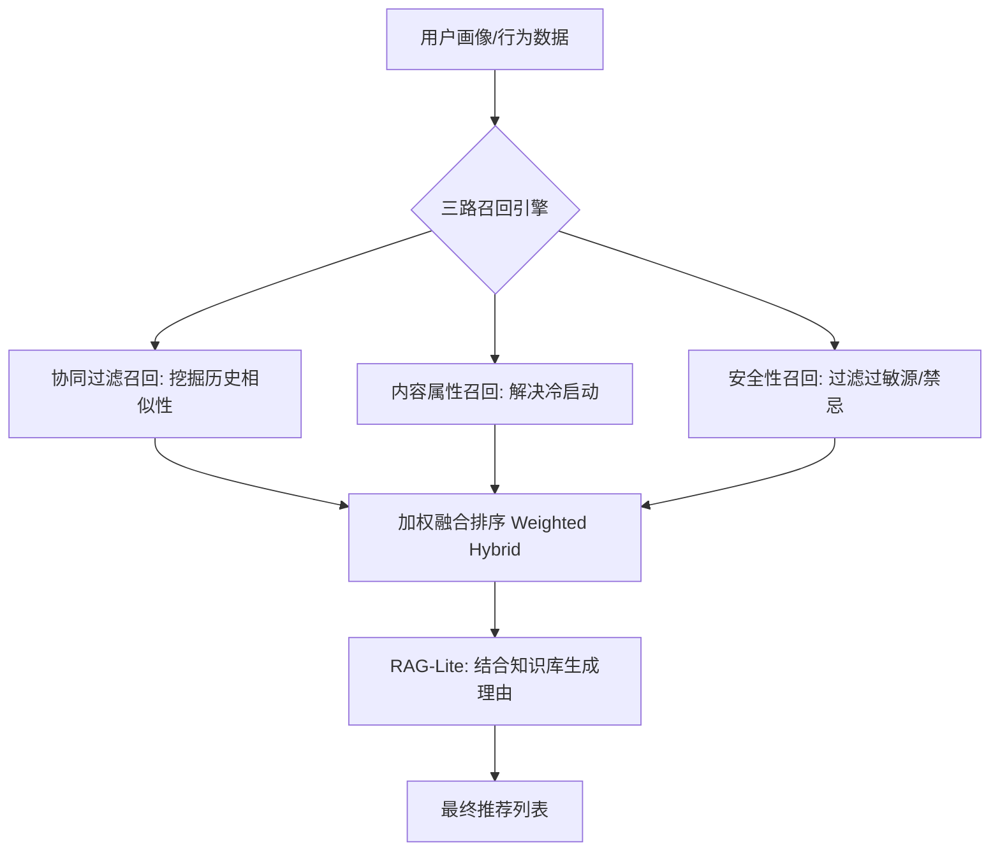

# Recommendation Logic Flow

```mermaid

    graph TD
      A[用户画像/行为数据] --> B{三路召回引擎}
      B --> C[协同过滤召回: 挖掘历史相似性]
      B --> D[内容属性召回: 解决冷启动]
      B --> E[安全性召回: 过滤过敏源/禁忌]
      C --> F[加权融合排序 Weighted Hybrid]
      D --> F
      E --> F
      F --> G[RAG-Lite: 结合知识库生成理由]
      G --> H[最终推荐列表]
    
```